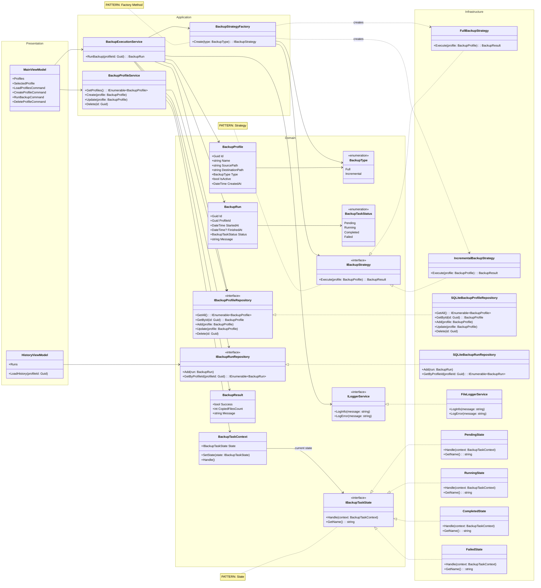

```mermaid
classDiagram
direction LR

namespace Domain {
    class BackupProfile {
        +Guid Id
        +string Name
        +string SourcePath
        +string DestinationPath
        +BackupType Type
        +bool IsActive
        +DateTime CreatedAt
    }

    class BackupRun {
        +Guid Id
        +Guid ProfileId
        +DateTime StartedAt
        +DateTime? FinishedAt
        +BackupTaskStatus Status
        +string Message
    }

    class BackupType {
        <<enumeration>>
        Full
        Incremental
    }

    class BackupTaskStatus {
        <<enumeration>>
        Pending
        Running
        Completed
        Failed
    }

    class IBackupStrategy {
        <<interface>>
        +Execute(profile: BackupProfile): BackupResult
    }

    class IBackupProfileRepository {
        <<interface>>
        +GetAll(): IEnumerable~BackupProfile~
        +GetById(id: Guid): BackupProfile
        +Add(profile: BackupProfile)
        +Update(profile: BackupProfile)
        +Delete(id: Guid)
    }

    class IBackupRunRepository {
        <<interface>>
        +Add(run: BackupRun)
        +GetByProfileId(profileId: Guid): IEnumerable~BackupRun~
    }

    class ILoggerService {
        <<interface>>
        +LogInfo(message: string)
        +LogError(message: string)
    }

    class IBackupTaskState {
        <<interface>>
        +Handle(context: BackupTaskContext)
        +GetName(): string
    }

    class BackupResult {
        +bool Success
        +int CopiedFilesCount
        +string Message
    }

    class BackupTaskContext {
        +IBackupTaskState State
        +SetState(state: IBackupTaskState)
        +Handle()
    }
}

namespace Application {
    class BackupProfileService {
        +GetProfiles(): IEnumerable~BackupProfile~
        +Create(profile: BackupProfile)
        +Update(profile: BackupProfile)
        +Delete(id: Guid)
    }

    class BackupExecutionService {
        +RunBackup(profileId: Guid): BackupRun
    }

    class BackupStrategyFactory {
        +Create(type: BackupType): IBackupStrategy
    }
}

namespace Infrastructure {
    class FullBackupStrategy {
        +Execute(profile: BackupProfile): BackupResult
    }

    class IncrementalBackupStrategy {
        +Execute(profile: BackupProfile): BackupResult
    }

    class SQLiteBackupProfileRepository {
        +GetAll(): IEnumerable~BackupProfile~
        +GetById(id: Guid): BackupProfile
        +Add(profile: BackupProfile)
        +Update(profile: BackupProfile)
        +Delete(id: Guid)
    }

    class SQLiteBackupRunRepository {
        +Add(run: BackupRun)
        +GetByProfileId(profileId: Guid): IEnumerable~BackupRun~
    }

    class FileLoggerService {
        +LogInfo(message: string)
        +LogError(message: string)
    }

    class PendingState {
        +Handle(context: BackupTaskContext)
        +GetName(): string
    }

    class RunningState {
        +Handle(context: BackupTaskContext)
        +GetName(): string
    }

    class CompletedState {
        +Handle(context: BackupTaskContext)
        +GetName(): string
    }

    class FailedState {
        +Handle(context: BackupTaskContext)
        +GetName(): string
    }
}

namespace Presentation {
    class MainViewModel {
        +Profiles
        +SelectedProfile
        +LoadProfilesCommand
        +CreateProfileCommand
        +RunBackupCommand
        +DeleteProfileCommand
    }

    class HistoryViewModel {
        +Runs
        +LoadHistory(profileId: Guid)
    }
}

BackupProfile --> BackupType
BackupRun --> BackupTaskStatus
BackupTaskContext --> IBackupTaskState : current state

IBackupStrategy <|.. FullBackupStrategy
IBackupStrategy <|.. IncrementalBackupStrategy

IBackupProfileRepository <|.. SQLiteBackupProfileRepository
IBackupRunRepository <|.. SQLiteBackupRunRepository
ILoggerService <|.. FileLoggerService

IBackupTaskState <|.. PendingState
IBackupTaskState <|.. RunningState
IBackupTaskState <|.. CompletedState
IBackupTaskState <|.. FailedState

BackupProfileService --> IBackupProfileRepository
BackupExecutionService --> IBackupProfileRepository
BackupExecutionService --> IBackupRunRepository
BackupExecutionService --> ILoggerService
BackupExecutionService --> BackupStrategyFactory
BackupExecutionService --> BackupTaskContext
BackupExecutionService --> BackupRun
BackupExecutionService --> BackupResult
BackupExecutionService --> BackupProfile

BackupStrategyFactory --> IBackupStrategy
BackupStrategyFactory --> BackupType
BackupStrategyFactory ..> FullBackupStrategy : creates
BackupStrategyFactory ..> IncrementalBackupStrategy : creates

MainViewModel --> BackupProfileService
MainViewModel --> BackupExecutionService
HistoryViewModel --> IBackupRunRepository

note for IBackupStrategy "PATTERN: Strategy"
note for BackupStrategyFactory "PATTERN: Factory Method"
note for IBackupTaskState "PATTERN: State"
```
